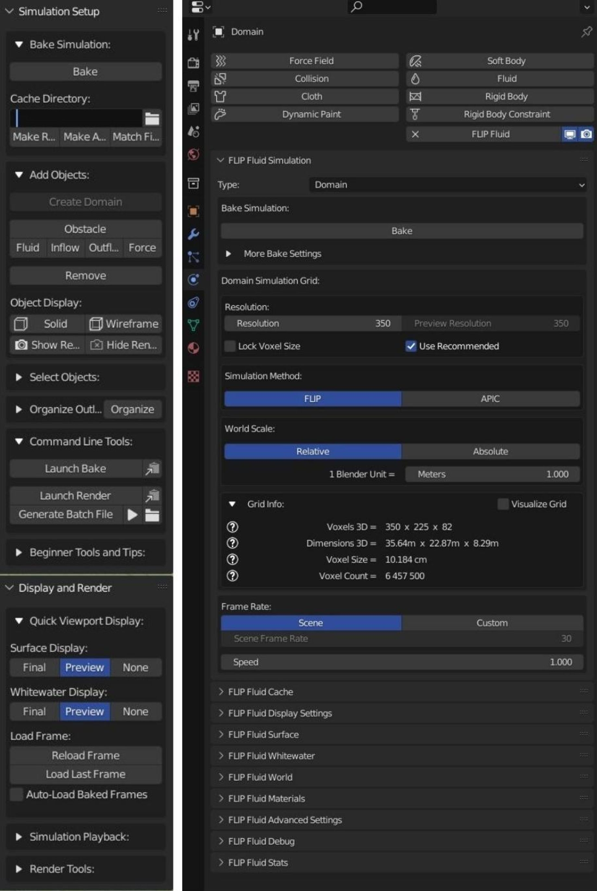
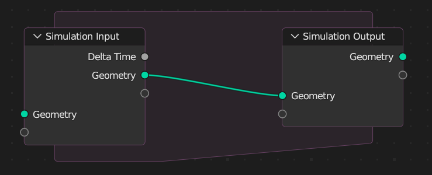

The intended stakeholders for this project include but are not limited to:
- VFX houses
	- These are usually small to medium sized companies, specialising in visual effects for videos. These companies usually are host to video editors, compositors, animators, 3D artists and modellers. Much of the available tooling used for simulating fluids is geared towards physical accuracy, and requires lots of time to compute simulations.  Furthermore, the available tools require lots of setup and knowledge of complex software used for many parts of the toolchain, only one of of which is the simulation needed. Thus, there is room for a simple simulation tool that runs in real-time, and produces files which can easily be composited and worked with by professionals otherwise unskilled in 3D or 2D simulation software.
- Animators
	- During the animation process, there are several stages where mock-ups are required, whether it's just so that further planning can be done, or that a client may want to see WIP versions of the animation. In these cases, the layout of a scene, and the entire animation itself is subject to change, and so a fast animation tool that can be used to approximate the highly accurate PBD simulations used for the final product may be useful. 
### Methods of research on stakeholders
To find the exact needs of the various stakeholders, it would be appropriate to interview a person who fits the description for each type of stakeholder identified above. As the primary reason that one might chose this simulator over a different solution is the possible workflow improvements allowed for by the chosen export method, that should be one of, if not *the* focus of any questions posed to stakeholders. Further, it would be useful to examine similar programs offered by competitors. To this end, it may be useful to examine their user interface, as well as some of the more general features offered. 
### Research into other systems
As part of the research into the stakeholders' needs, we must investigate the currently available alternatives commonly used in the market. The main competitors are the Blender Software Foundation's *Blender* and Autodesk's *3ds Max*. Each of these programs are more general modelling and animation software packages with a simulation component.  

##### Blender
Blender is a free and open source 3D graphics suite. As part of its modelling and animation panels, it is possible to utilise two different methods of simulating fluids, though there is a preferred methods for my clients.
###### Simulation Tab
As part of the animation suite, it is possible to apply several different types of simulation. This includes the following:
- Rigid body Simulation
- Soft body Simulation
- Cloth Simulation
- Fluid Simulation
Shown below is an example user interface for configuring the parameters of a simulation:

It is plain to see that this consists of a dizzying array of options and toggles, with more hidden behind dropdowns and buttons besides. For a newcomer to the industry, a hobbyist or even just a professional attempting to get done quickly, this amount of tinkering opportunity can be overwhelming. Though this does provide room for many different options and boxes, which suggests that with some further organisation, this method of presenting options to the user could be optimal.
###### Simulation Nodes
Blender also provides another, even more customisable method of simulating objects. This is the simulation node.

This is a highly-procedural node-bases system for controlling simulations, and outputting a modified geometry based on the simulation used. This allows for more than just the basic simulations, and allows for completely custom simulations to be made quickly
##### 3ds Max
Much like Blender, Autodesk 3ds Max is a full 3D graphics workstation. It combines tools for modelling, sculpting, simulating and animating. Further, these tools are all able to be combined together seamlessly, not that doing so is particularly easy to run on ordinary hardware.

The software is commonly used all throughout the 3D graphics pipeline, in big and small studios alike. However, unlike blender, it must be rented through a costly subscription model.
##### The interface

The interface for simulation parameters in 3ds Max is much like the interface for blender. However, unlike blender, such windows can be separated and moved around to create a workspace more tailored to its user. Such a similar interface is useful when dealing with many types of simulation, with plugins available for even more, and more specialised ones at that. 

